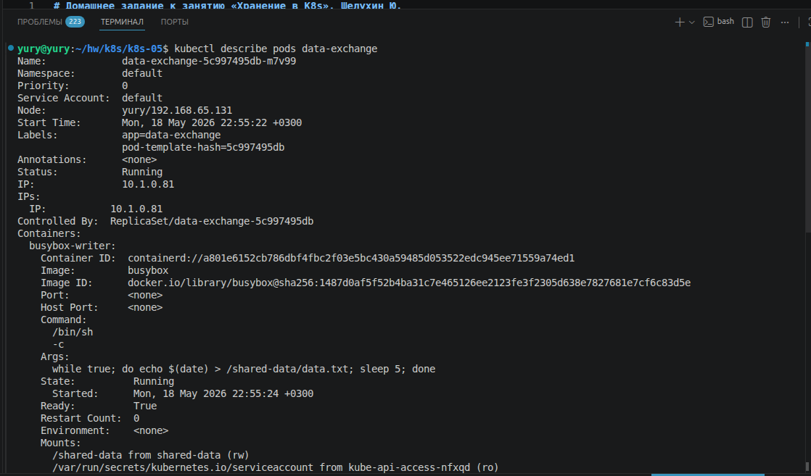
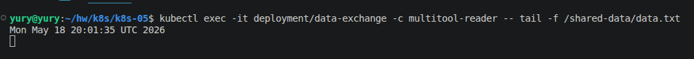
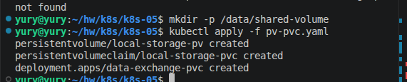
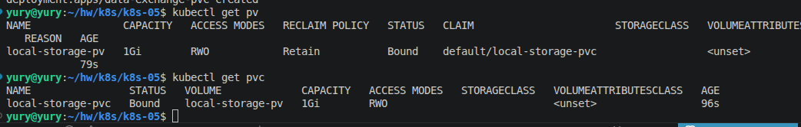
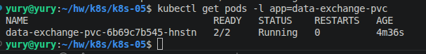
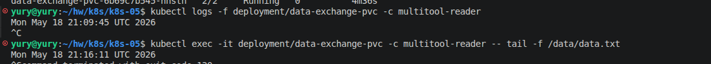
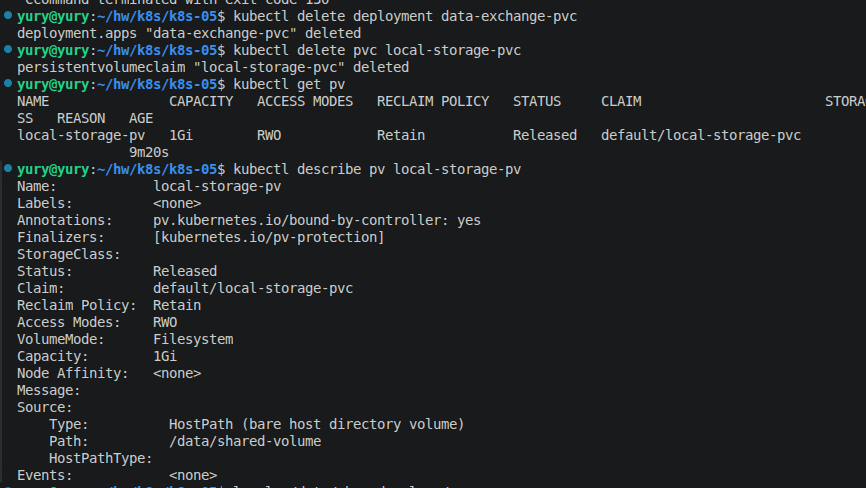
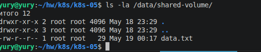
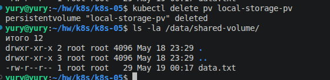
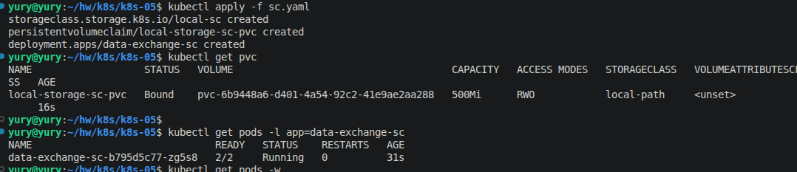

# Домашнее задание к занятию «Хранение в K8s». Шелухин Ю.

### Примерное время выполнения задания — 180 минут

### Цель задания

Научиться работать с хранилищами в тестовой среде Kubernetes:
- обеспечить обмен файлами между контейнерами пода;
- создавать **PersistentVolume** (PV) и использовать его в подах через **PersistentVolumeClaim** (PVC);
- объявлять свой **StorageClass** (SC) и монтировать его в под через **PVC**.

Это задание поможет вам освоить базовые принципы взаимодействия с хранилищами в Kubernetes — одного из ключевых навыков для работы с кластерами. На практике Volume, PV, PVC используются для хранения данных независимо от пода, обмена данными между подами и контейнерами внутри пода. Понимание этих механизмов поможет вам упростить проектирование слоя данных для приложений, разворачиваемых в кластере k8s.

------

## **Подготовка**
### **Чеклист готовности**

1. Установленное K8s-решение (допустим, MicroK8S).
2. Установленный локальный kubectl.
3. Редактор YAML-файлов с подключенным GitHub-репозиторием.

------

### Инструменты, которые пригодятся для выполнения задания

1. [Инструкция](https://microk8s.io/docs/getting-started) по установке MicroK8S.
2. [Инструкция](https://minikube.sigs.k8s.io/docs/start/?arch=%2Fwindows%2Fx86-64%2Fstable%2F.exe+download) по установке Minikube. 
3. [Инструкция](https://kubernetes.io/docs/tasks/tools/install-kubectl-windows/) по установке kubectl.
4. [Инструкция](https://marketplace.visualstudio.com/items?itemName=ms-kubernetes-tools.vscode-kubernetes-tools) по установке VS Code

### Дополнительные материалы, которые пригодятся для выполнения задания
1. [Описание Volumes](https://kubernetes.io/docs/concepts/storage/volumes/).
2. [Описание Ephemeral Volumes](https://kubernetes.io/docs/concepts/storage/volumes/).
3. [Описание PersistentVolume](https://kubernetes.io/docs/concepts/storage/persistent-volumes/).
4. [Описание PersistentVolumeClaim](https://kubernetes.io/docs/concepts/storage/persistent-volumes/#persistentvolumeclaims).
5. [Описание StorageClass](https://kubernetes.io/docs/concepts/storage/storage-classes/).
6. [Описание Multitool](https://github.com/wbitt/Network-MultiTool).

------

## Задание 1. Volume: обмен данными между контейнерами в поде
### Задача

Создать Deployment приложения, состоящего из двух контейнеров, обменивающихся данными.

### Шаги выполнения
1. Создать Deployment приложения, состоящего из контейнеров busybox и multitool.
2. Настроить busybox на запись данных каждые 5 секунд в некий файл в общей директории.
3. Обеспечить возможность чтения файла контейнером multitool.


### Что сдать на проверку
- Манифесты:
  - `containers-data-exchange.yaml`
- Скриншоты:
  - описание пода с контейнерами (`kubectl describe pods data-exchange`)
  - вывод команды чтения файла (`tail -f <имя общего файла>`)

#
[containers-data-exchange.yaml](containers-data-exchange.yaml)
  
  

------

## Задание 2. PV, PVC
### Задача
Создать Deployment приложения, использующего локальный PV, созданный вручную.

### Шаги выполнения
1. Создать Deployment приложения, состоящего из контейнеров busybox и multitool, использующего созданный ранее PVC
2. Создать PV и PVC для подключения папки на локальной ноде, которая будет использована в поде.
3. Продемонстрировать, что контейнер multitool может читать данные из файла в смонтированной директории, в который busybox записывает данные каждые 5 секунд. 
4. Удалить Deployment и PVC. Продемонстрировать, что после этого произошло с PV. Пояснить, почему. (Используйте команду `kubectl describe pv`).
5. Продемонстрировать, что файл сохранился на локальном диске ноды. Удалить PV.  Продемонстрировать, что произошло с файлом после удаления PV. Пояснить, почему.


### Что сдать на проверку
- Манифесты:
  - `pv-pvc.yaml`
- Скриншоты:
  - каждый шаг выполнения задания, начиная с шага 2.
- Описания:
  - объяснение наблюдаемого поведения ресурсов в двух последних шагах.

#
1-2. Создадим директорию на хосте.
`mkdir -p /data/shared-volume`
Создвдим деплой.

  

Проверим статус pv, pvc и pod.

  
  

3. Проверь чтение логов и формирование файла в volume.  
`kubectl logs -f deployment/data-exchange-pvc -c multitool-reader`  
`kubectl exec -it deployment/data-exchange-pvc -c multitool-reader -- tail -f /data/data.txt`

  

4. Удалим Deployment и PVC.

  

Убедимся, что PV находится в статусе Released.
Политика persistentVolumeReclaimPolicy: Retain означает, что PV не удаляется автоматически.

5. Проверим файл на локальном диске.

  

Удалим pv вручную и снова проверим файл.

  

Данные на диске хоста Kubernetes не удаляет. 

[pv-pvc.yaml](pv-pv.yml)

------


## Задание 3. StorageClass
### Задача
Создать Deployment приложения, использующего PVC, созданный на основе StorageClass.

### Шаги выполнения

1. Создать Deployment приложения, состоящего из контейнеров busybox и multitool, использующего созданный ранее PVC.
2. Создать SC и PVC для подключения папки на локальной ноде, которая будет использована в поде.
3. Продемонстрировать, что контейнер multitool может читать данные из файла в смонтированной директории, в который busybox записывает данные каждые 5 секунд.

### Что сдать на проверку
- Манифесты:
  - `sc.yaml`
- Скриншоты:
  - каждый шаг выполнения задания, начиная с шага 2
---
## Шаблоны манифестов с учебными комментариями
### 1. Deployment (containers-data-exchange.yaml)
```yaml
apiVersion: apps/v1
kind: Deployment
metadata:
  name: data-exchange
spec:
  replicas: # ЗАДАНИЕ: Укажите количество реплик
  selector:
    matchLabels:
      app: # ДОПОЛНИТЕ: Метка для селектора
  template:
    metadata:
      labels:
        app: # ПОВТОРИТЕ: Метка из selector.matchLabels
    spec:
      containers:
      - name: # ДОПОЛНИТЕ: Имя первого контейнера
        image: busybox
        command: ["/bin/sh", "-c"] 
        args: ["echo $(date) > путь_к_файлу; sleep 3600"] # КЛЮЧЕВОЕ: Команда записи данных в файл в директории из секции volumeMounts контейнера
        volumeMounts:
        - name: # ДОПОЛНИТЕ: Имя монтируемого раздела. Должно совпадать с именем эфемерного хранилища, объявленного на уровне пода.
          mountPath: # КЛЮЧЕВОЕ: Путь монтирования эфемерного хранилища внутри контейнера 1
      - name: # ДОПОЛНИТЕ: Имя второго контейнера
        image: busybox
        command: ["/bin/sh", "-c"]
        args: ["tail -f путь_к_файлу"] # КЛЮЧЕВОЕ: Команда для чтения данных из файла, расположенного в директории, указанной в volumeMounts контейнера
        volumeMounts:
        - name: # ДОПОЛНИТЕ: Имя монтируемого раздела. Должно совпадать с именем эфемерного хранилища, объявленного на уровне пода
          mountPath: # КЛЮЧЕВОЕ: Путь монтирования эфемерного хранилища внутри контейнера 2
      volumes:
      - name: # ДОПОЛНИТЕ: Имя монтируемого раздела эфемерного хранилища
        emptyDir: {} # ИНФОРМАЦИЯ: Определяем эфемерное хранилище, которое работает только внутри пода
```
### 2. Deployment (pv-pvc.yaml)
```yaml
---
apiVersion: v1
kind: PersistentVolume
metadata:
  name: # ДОПОЛНИТЕ: Имя хранилища
spec:
  capacity:
    storage: 1Gi
  volumeMode: Filesystem
  accessModes:
    - ReadWriteOnce
  persistentVolumeReclaimPolicy: Retain
  hostPath:
    path: # КЛЮЧЕВОЕ: Путь к директории на ноде (хосте, на котором развёрнут кластер)
---
apiVersion: v1
kind: PersistentVolumeClaim
metadata:
  name: # ДОПОЛНИТЕ: Имя PVC
spec:
  volumeName: # ДОПОЛНИТЕ: Имя PV, к которому будет привязан PVC, должен совпадать с созданным ранее PV
  volumeMode: Filesystem
  accessModes:
    - ReadWriteOnce
  resources:
    requests:
      storage: # ДОПОЛНИТЕ: Какой объём хранилища вы хотите передать в контейнер. Должно быть меньше или равно параметру storage из PV
---
apiVersion: apps/v1
kind: Deployment
metadata:
  name: data-exchange-pvc
spec:
  replicas: # ЗАДАНИЕ: Укажите количество реплик
  selector:
    matchLabels:
      app: # ДОПОЛНИТЕ: Метка для селектора
  template:
    metadata:
      labels:
        app: # ПОВТОРИТЕ: Метка из selector.matchLabels
    spec:
      containers:
      - name: # ДОПОЛНИТЕ: Имя первого контейнера
        image: busybox
        command: ["/bin/sh", "-c"] 
        args: ["echo $(date) > путь_к_файлу; sleep 3600"] # КЛЮЧЕВОЕ: Команда записи данных в файл в директории из секции volumeMounts контейнера 
        volumeMounts:
        - name: # ДОПОЛНИТЕ: Имя монтируемого раздела. Должно совпадать с именем хранилища, объявленного на уровне пода
          mountPath: # КЛЮЧЕВОЕ: Путь монтирования хранилища внутри контейнера 1
      - name: # ДОПОЛНИТЕ: Имя второго контейнера
        image: busybox
        command: ["/bin/sh", "-c"]
        args: ["tail -f путь_к_файлу"] # КЛЮЧЕВОЕ: Команда для чтения данных из файла, расположенного в директории, указанной в volumeMounts контейнера
        volumeMounts:
        - name: # ДОПОЛНИТЕ: Имя монтируемого раздела. Должно совпадать с именем хранилища, объявленного на уровне пода
          mountPath: # КЛЮЧЕВОЕ: Путь монтирования хранилища внутри контейнера 2
      volumes:
      - name: # ДОПОЛНИТЕ: Имя монтируемого раздела хранилища
        persistentVolumeClaim:
          claimName: # КЛЮЧЕВОЕ: Совпадает с именем PVC объявленного ранее
```
### 3. Deployment (sc.yaml)
```yaml
apiVersion: storage.k8s.io/v1
kind: StorageClass
metadata:
  name: # ДОПОЛНИТЕ: Имя StorageClass
provisioner: kubernetes.io/no-provisioner # ИНФОРМАЦИЯ: Нет автоматического развёртывания
volumeBindingMode: WaitForFirstConsumer
---
apiVersion: v1
kind: PersistentVolumeClaim
metadata:
  name: # ДОПОЛНИТЕ: Имя PVC
spec:
  volumeMode: Filesystem
  accessModes:
    - ReadWriteOnce
  resources:
    requests:
      storage: # ДОПОЛНИТЕ: Какой объем хранилища вы хотите передать в контейнер. Должно быть меньше или равно параметру storage из PV
  storageClassName: # ДОПОЛНИТЕ: Имя StorageClass. Должно совпадать с объявленным ранее
---
apiVersion: apps/v1
kind: Deployment
metadata:
  name: data-exchange-sc
spec:
  replicas: # ЗАДАНИЕ: Укажите количество реплик
  selector:
    matchLabels:
      app: # ДОПОЛНИТЕ: Метка для селектора
  template:
    metadata:
      labels:
        app: # ПОВТОРИТЕ: Метка из selector.matchLabels
    spec:
      containers:
      - name: # ДОПОЛНИТЕ: Имя первого контейнера
        image: busybox
        command: ["/bin/sh", "-c"] 
        args: ["echo $(date) > путь_к_файлу; sleep 3600"] # КЛЮЧЕВОЕ: Команда для чтения данных из файла, расположенного в директории, указанной в volumeMounts контейнера
        volumeMounts:
        - name: # ДОПОЛНИТЕ: Имя монтируемого раздела. Должно совпадать с именем хранилища, объявленного на уровне пода
          mountPath: # КЛЮЧЕВОЕ: Путь монтирования хранилища внутри контейнера 1
      - name: # ДОПОЛНИТЕ: Имя второго контейнера
        image: busybox
        command: ["/bin/sh", "-c"]
        args: ["tail -f путь_к_файлу"] # КЛЮЧЕВОЕ: Команда для чтения данных из файла, расположенного в директории, указанной в volumeMounts контейнера
        volumeMounts:
        - name: # ДОПОЛНИТЕ: Имя монтируемого раздела. Должно совпадать с именем хранилища, объявленного на уровне пода
          mountPath: # КЛЮЧЕВОЕ: Путь монтирования хранилища внутри контейнера 2
      volumes:
      - name: # ДОПОЛНИТЕ: Имя монтируемого раздела хранилища
        persistentVolumeClaim:
          claimName: # КЛЮЧЕВОЕ: Совпадает с именем PVC объявленного ранее
```

## **Правила приёма работы**
1. Домашняя работа оформляется в своём Git-репозитории в файле README.md. Выполненное домашнее задание пришлите ссылкой на .md-файл в вашем репозитории.
2. Файл README.md должен содержать скриншоты вывода необходимых команд `kubectl`, скриншоты результатов, пояснения.
3. Репозиторий должен содержать тексты манифестов или ссылки на них в файле README.md.

## **Критерии оценивания задания**
1. Зачёт: Все задачи выполнены, манифесты корректны, есть доказательства работы (скриншоты) и пояснения по заданию 2.
2. Доработка (на доработку задание направляется 1 раз): основные задачи выполнены, при этом есть ошибки в манифестах или отсутствуют проверочные скриншоты.
3. Незачёт: работа выполнена не в полном объёме, есть ошибки в манифестах, отсутствуют проверочные скриншоты. Все попытки доработки израсходованы (на доработку работа направляется 1 раз). Этот вид оценки используется крайне редко.

## **Срок выполнения задания**  
1. 5 дней на выполнение задания.
2. 5 дней на доработку задания (в случае направления задания на доработку).


# Домашнее задание к занятию «Сетевое взаимодействие в Kubernetes». Шелухин Юрий.

### Примерное время выполнения задания

120 минут

### Цель задания

Научиться настраивать доступ к приложениям в Kubernetes:
- Внутри кластера через **Service** (ClusterIP, NodePort).
- Снаружи кластера через **Ingress**.

Это задание поможет вам освоить базовые принципы сетевого взаимодействия в Kubernetes — ключевого навыка для работы с кластерами.
На практике Service и Ingress используются для доступа к приложениям, балансировки нагрузки и маршрутизации трафика. Понимание этих механизмов поможет вам упростить управление сервисами в рабочих окружениях и снизит риски ошибок при развёртывании.

------

## **Подготовка**
### **Чеклист готовности**
- Установлен Kubernetes (MicroK8S, Minikube или другой).
- Установлен `kubectl`.
- Редактор для YAML-файлов (VS Code, Vim и др.).

------

### Инструменты, которые пригодятся для выполнения задания

1. [Инструкция](https://microk8s.io/docs/getting-started) по установке MicroK8S.
2. [Инструкция](https://minikube.sigs.k8s.io/docs/start/?arch=%2Fwindows%2Fx86-64%2Fstable%2F.exe+download) по установке Minikube. 
3. [Инструкция](https://kubernetes.io/docs/tasks/tools/install-kubectl-windows/)по установке kubectl.
4. [Инструкция](https://marketplace.visualstudio.com/items?itemName=ms-kubernetes-tools.vscode-kubernetes-tools) по установке VS Code

### Дополнительные материалы, которые пригодятся для выполнения задания

1. [Описание](https://kubernetes.io/docs/concepts/workloads/controllers/deployment/) Deployment и примеры манифестов.
2. [Описание](https://kubernetes.io/docs/concepts/services-networking/service/) Описание Service.
3. [Описание](https://kubernetes.io/docs/concepts/services-networking/ingress/) Ingress.
4. [Описание](https://github.com/wbitt/Network-MultiTool) Multitool.

------

## **Задание 1: Настройка Service (ClusterIP и NodePort)**
### **Задача**
Развернуть приложение из двух контейнеров (`nginx` и `multitool`) и обеспечить доступ к ним:
- Внутри кластера через **ClusterIP**.
- Снаружи через **NodePort**.

### **Шаги выполнения**
1. **Создать Deployment** с двумя контейнерами:
   - `nginx` (порт `80`).
   - `multitool` (порт `8080`).
   - Количество реплик: `3`.

#
     


2. **Создать Service типа ClusterIP**, который:
   - Открывает `nginx` на порту `9001`.
   - Открывает `multitool` на порту `9002`.

#

  
   
3. **Проверить доступность** изнутри кластера:

```bash
 kubectl run test-pod --image=wbitt/network-multitool --rm -it -- sh
 curl <service-name>:9001 # Проверить nginx
 curl <service-name>:9002 # Проверить multitool
```

#
Перед проверкой включим addon DNS.  
`microk8s enable dns`

  

4. **Создать Service типа NodePort** для доступа к `nginx` снаружи.

#

   

5. **Проверить доступ** с локального компьютера:
```bash
 curl <node-ip>:<node-port>
   ```
 или через браузер.

#
Уточним IP узлов.  
`kubectl get nodes -o wide`


В задании использованы манифесты:  
[deployment](deployment.yaml)  
[service](service.yaml)  
[nginx-nodeport-service](nginx-nodeport-service.yaml)  


### **Что сдать на проверку**
- Манифесты:
  - `deployment-multi-container.yaml`
  - `service-clusterip.yaml`
  - `service-nodeport.yaml`
- Скриншоты проверки доступа (`curl` или браузер).

---
## **Задание 2: Настройка Ingress**
### **Задача**
Развернуть два приложения (`frontend` и `backend`) и обеспечить доступ к ним через **Ingress** по разным путям.

### **Шаги выполнения**
1. **Развернуть два Deployment**:
   - `frontend` (образ `nginx`).
   - `backend` (образ `wbitt/network-multitool`).

#
Создадим файлы frontend-deployment.yaml и backend-deployment.yaml


2. **Создать Service** для каждого приложения.

#
Создадим файлы frontend-service.yaml и backend-service.yaml


3. **Включить Ingress-контроллер**:
```bash
 microk8s enable ingress
   ```
#


4. **Создать Ingress**, который:
   - Открывает `frontend` по пути `/`.
   - Открывает `backend` по пути `/api`.

#
Создадим файл ingress.yaml.
Применим все манифесты.
```
kubectl apply -f frontend-deployment.yaml
kubectl apply -f backend-deployment.yaml
kubectl apply -f frontend-service.yaml
kubectl apply -f backend-service.yaml
kubectl apply -f ingress.yaml
```


5. **Проверить доступность**:
```bash
 curl <host>/
 curl <host>/api
   ```
 или через браузер.

 #
 


В задании использованы манифесты:    
[backend-deployment](backend-deployment.yaml)  
[backend-service](backend-service.yaml)  
[frontend-service](frontend-service.yaml)  
[frontend-deployment](frontend-deployment.yaml)  
[ingress](ingress.yaml)   


### **Что сдать на проверку**
- Манифесты:
  - `deployment-frontend.yaml`
  - `deployment-backend.yaml`
  - `service-frontend.yaml`
  - `service-backend.yaml`
  - `ingress.yaml`
- Скриншоты проверки доступа (`curl` или браузер).

---
## Шаблоны манифестов с учебными комментариями
### **1. Deployment (nginx + multitool)**
```yaml
apiVersion: apps/v1
kind: Deployment
metadata:
  name: # ПРИМЕР: "multi-container-app"
spec:
  replicas: # ЗАДАНИЕ: Укажите количество реплик
  selector:
    matchLabels:
      app: # ДОПОЛНИТЕ: Метка для селектора
  template:
    metadata:
      labels:
        app: # ПОВТОРИТЕ метку из selector.matchLabels
    spec:
      containers:
 - name: # ЗАДАНИЕ: Название первого контейнера
        image: nginx
        ports:
 - containerPort: 80
 - name: multitool
        image: wbitt/network-multitool
        ports:
 - containerPort: 8080
        env:
 - name: HTTP_PORT
          value: "8080" # КЛЮЧЕВОЙ МОМЕНТ: Порт должен совпадать с containerPort
```
### **2. Ingress (для frontend и backend)**
```yaml
apiVersion: networking.k8s.io/v1
kind: Ingress
metadata:
  name: # ЗАДАНИЕ: Придумайте имя, допустим example-ingress
  annotations:  # ВАЖНО: Эта аннотация нужна для rewrite правил
    nginx.ingress.kubernetes.io/rewrite-target: /
spec:
  rules:
 - http:
      paths:
 - path: /
        pathType: Prefix
        backend:
          service:
            name: # УКАЖИТЕ: Имя frontend Service
            port:
              number: 80
 - path: /api # КЛЮЧЕВОЙ ПУТЬ: API endpoint
        pathType: Prefix
        backend:
          service:
            name: # УКАЖИТЕ: Имя backend Service
            port:
              number: 80
```
---


## **Правила приёма работы**
1. Домашняя работа оформляется в своём Git-репозитории в файле README.md. Выполненное домашнее задание пришлите ссылкой на .md-файл в вашем репозитории.
2. Файл README.md должен содержать скриншоты вывода необходимых команд `kubectl` и скриншоты результатов.
3. Репозиторий должен содержать тексты манифестов или ссылки на них в файле README.md.

## **Критерии оценивания задания**
1. Зачёт: Все задачи выполнены, манифесты корректны, есть доказательства работы (скриншоты).
2. Доработка (на доработку задание направляется 1 раз): основные задачи выполнены, при этом есть ошибки в манифестах или отсутствуют проверочные скриншоты.
3. Незачёт: работа выполнена не в полном объёме, есть ошибки в манифестах, отсутствуют проверочные скриншоты. Все попытки доработки израсходованы (на доработку работа направляется 1 раз). Этот вид оценки используется крайне редко.

## **Срок выполнения задания**  
1. 5 дней на выполнение задания.
2. 5 дней на доработку задания (в случае направления задания на доработку).